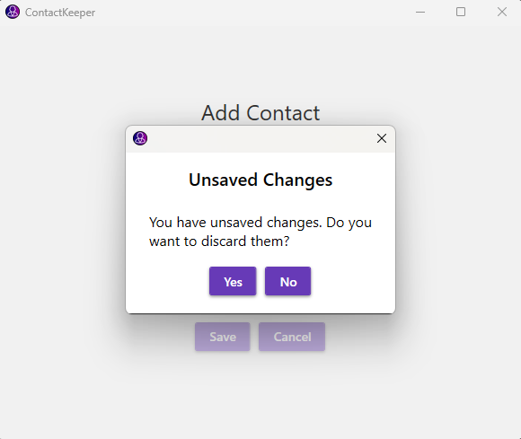

# ContactKeeper

ContactKeeper is a contact management application for Windows Desktop that allows users to store and manage their contacts. It is built using a layered architecture and follows the MVVM (Model-View-ViewModel) design pattern. The application uses JSON as the data storage format and implements a repository pattern for data access.

## Features

- Add, edit, and delete contacts
- View a list of all contacts
- Sort contacts by name or date added

## Planned Features

- Installer
- Search contacts by name or other attributes
- Multiple email addresses and phone numbers per contact
- Import and export contacts from/to other formats
- Integration with Google Contacts
- Themes and customization options
- Support for more languages
- Backup and restore functionality

## Screenshots

<table>
  <tr>
    <td>
      
      
Add Contact

    </td>
    <td>
      
      
Edit Contact

    </td>
  </tr>
  <tr>    
    <td>
      
      
Unsaved Changes

    </td>
    <td>
      
      
Confirm Overwrite

    </td>
  </tr>
</table>

## Dependencies

- .NET Framework 8.0 or higher
- CommunityToolkit.Mvvm v.8.2.2
- MaterialDesignThemes v.5.0.1-ci662
- Microsoft.Xaml.Behaviors.Wpf v.1.1.122
- Serilog v.4.0.0
- Serilog.Extensions.Logging v.8.0.1-dev-10391
- Serilog.Sinks.Debug v.3.0.0
- Serilog.Sinks.File v.5.0.1-dev-00972

And for testing:
- AutoBogus v.2.13.1
- Microsoft.NET.Test.Sdk v.17.10.0
- NSubstitute v.5.1.0
- NUnit v.4.1.0
- NUnit3TestAdapter v.4.5.0

## Building the Project

To build the ContactKeeper project, follow these steps:

1. Clone the repository to your local machine.
2. Open the solution file in Visual Studio.
3. Restore NuGet packages if necessary.
4. Build the solution.

## Data Storage

The contact data is stored in a JSON file. The file path is determined by the application's base directory and the default file name "contacts.json", e.g. `C:\Users\AuntieJoe\AppData\Roaming\ContactKeeper`.

## Project Structure

The ContactKeeper solution is structured as follows:

- ContactKeeper.UI: Contains the user interface components, including views and view models.
- ContactKeeper.Core: Contains the core business logic and models.
- ContactKeeper.Infrastructure: Contains the infrastructure components, such as repositories and utilities.

## Architecture and Design

ContactKeeper follows a layered architecture, with clear separation between the presentation layer (UI), business logic layer (Core), and data access layer (Infrastructure). The MVVM design pattern is used to separate the concerns of the user interface and the underlying data.

The UI layer consists of XAML views and corresponding view models. The views are responsible for displaying the user interface, while the view models handle the logic and data binding.

The Core layer contains the models and services that represent the contact entities and perform the necessary operations on them. The services communicate with the repositories in the Infrastructure layer to retrieve and persist the contact data.

The Infrastructure layer provides the implementation of the repositories and other utilities. The JSONContactRepository class is responsible for reading and writing the contact data to the JSON file.

## License

The ContactKeeper project is licensed under the GNU General Public License (GPL) version 3. You can find the full text of the license in the [LICENSE.txt](LICENSE.txt) file.
