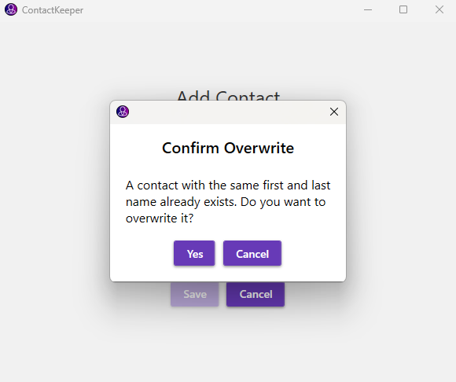

ContactKeeper is a contact management application for Windows Desktop that allows users to store and manage their contacts. It is built using a layered architecture and follows the MVVM (Model-View-ViewModel) design pattern. The application uses JSON as the data storage format and implements a repository pattern for data access.

## Features

- Add, edit, and delete contacts
- View a list of all contacts
- Sort contacts by name or date added

## Planned Features

- Search contacts by name or other attributes
- Multiple email addresses and phone numbers per contact
- Import and export contacts from/to other formats
- Integration with Google Contacts
- Themes and customization options
- Support for more languages
- Backup and restore functionality

## Screenshots

<table>
  <tr>
    <td>
      
      
Add Contact

    </td>
    <td>
      
      
Edit Contact

    </td>
  </tr>
  <tr>    
    <td>
      
      
Unsaved Changes

    </td>
    <td>
      
      
Confirm Overwrite

    </td>
  </tr>
</table>

## Dependencies

- .NET Framework 8.0 or higher
- CommunityToolkit.Mvvm v.8.2.2
- MaterialDesignThemes v.5.0.1-ci662
- Microsoft.Xaml.Behaviors.Wpf v.1.1.122
- Serilog v.4.0.0
- Serilog.Extensions.Logging v.8.0.1-dev-10391
- Serilog.Sinks.Debug v.3.0.0
- Serilog.Sinks.File v.5.0.1-dev-00972

And for testing:
- AutoBogus v.2.13.1
- Microsoft.NET.Test.Sdk v.17.10.0
- NSubstitute v.5.1.0
- NUnit v.4.1.0
- NUnit3TestAdapter v.4.5.0

## Building the Project

To build the ContactKeeper project, follow these steps:

1. Clone the repository to your local machine.
2. Open the solution file in Visual Studio.
3. Restore NuGet packages if necessary.
4. Build the solution.

## Data Storage

The contact data is stored in a JSON file. The file path is determined by the application's base directory and the default file name "contacts.json", e.g. `C:\Users\AuntieJoe\AppData\Roaming\ContactKeeper`.

## Project Structure

The ContactKeeper solution is structured as follows:

- ContactKeeper.UI: Contains the user interface components, including views and view models.
- ContactKeeper.Core: Contains the core business logic and models.
- ContactKeeper.Infrastructure: Contains the infrastructure components, such as repositories and utilities.

## Architecture and Design

ContactKeeper follows a layered architecture, with clear separation between the presentation layer (UI), business logic layer (Core), and data access layer (Infrastructure). The MVVM design pattern is used to separate the concerns of the user interface and the underlying data.

The UI layer consists of XAML views and corresponding view models. The views are responsible for displaying the user interface, while the view models handle the logic and data binding.

The Core layer contains the models and services that represent the contact entities and perform the necessary operations on them. The services communicate with the repositories in the Infrastructure layer to retrieve and persist the contact data.

The Infrastructure layer provides the implementation of the repositories and other utilities. The JSONContactRepository class is responsible for reading and writing the contact data to the JSON file.

## Continuous Integration Workflow

The ContactKeeper project uses GitHub Actions for Continuous Integration (CI), ensuring that every push and pull request to the `main` branch triggers a series of automated steps to build, test, and prepare the application for release. The CI workflow is defined in the `.github/workflows/ci.yml` file and consists of the following steps:

1. **Checkout Code**: The workflow checks out the latest code from the `main` branch to run the subsequent steps.

2. **Setup .NET SDK**: Sets up the .NET 8 SDK, allowing the use of .NET CLI tools in the workflow.

3. **Restore Dependencies**: Executes `dotnet restore` to restore all the necessary .NET dependencies specified in the project files.

4. **Build Solution**: Compiles the entire solution using `dotnet build --no-restore` to ensure that the code builds correctly without restoring dependencies again.

5. **Run Tests**: Runs unit tests for the Core, Infrastructure, and UI projects separately using `dotnet test`, ensuring that all tests pass. This step is crucial for maintaining code quality and functionality.

6. **Publish Artifact**: If all tests pass, the workflow publishes the UI project as a self-contained application for different architectures (win-x64, win-x86, win-arm64). This step prepares the application for distribution by packaging it into a single file.

7. **Upload Artifact**: The published artifacts are uploaded to GitHub, making them available for download. This step ensures that the built application can be easily accessed and deployed.

The following steps only apply if a tag matching the version pattern is pushed to the repository:
  
8. **Create GitHub Release**: After the build and test steps are successfully completed, the workflow creates a GitHub Release. This step is performed by the `release` job, which runs on an Ubuntu-latest runner. It uses the `ncipollo/release-action` action to create a new release on GitHub, tagging the current commit with the version number and adding a release name. This makes the release officially available to users and marks a stable version of the application.

9. **Upload Release Assets**: Finally, the workflow uploads the previously built artifacts as assets to the GitHub Release. This ensures that the application's executable files are attached to the release, making it easy for users to download the latest version of the application directly from the GitHub Releases page.

The CI workflow is triggered automatically on every push and pull request to the `main` branch, ensuring that the codebase remains stable and deployable at all times.

## License

The ContactKeeper project is licensed under the GNU General Public License (GPL) version 3. You can find the full text of the license in the [LICENSE.txt](LICENSE.txt) file.

